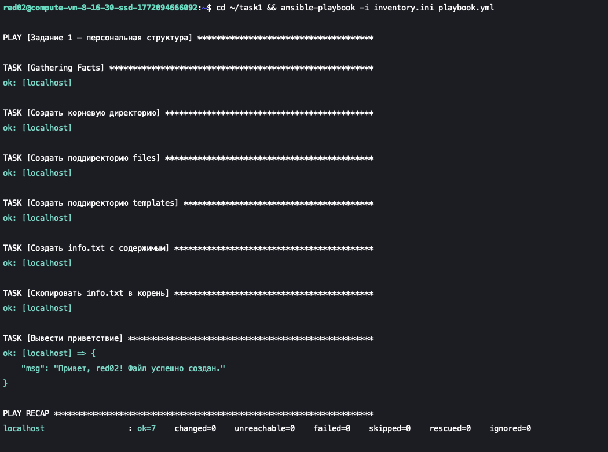
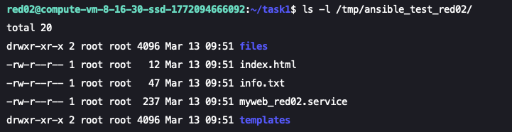
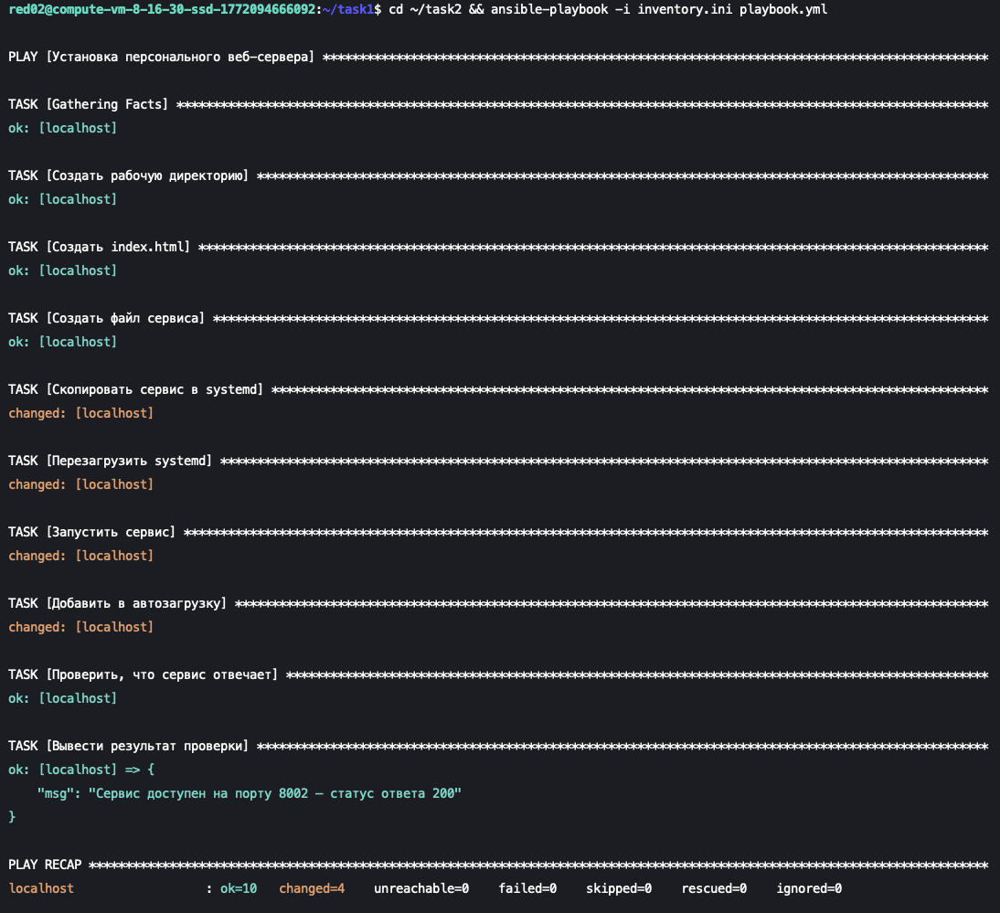
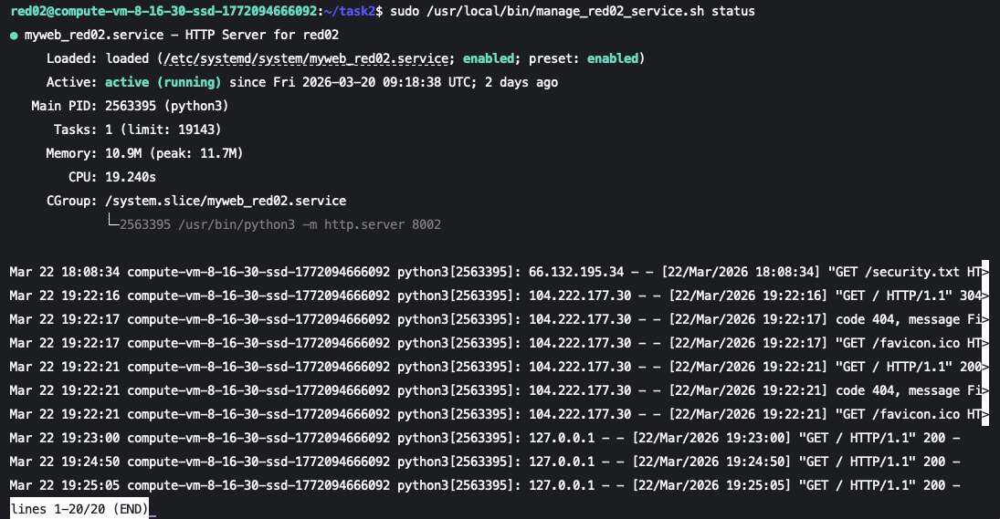
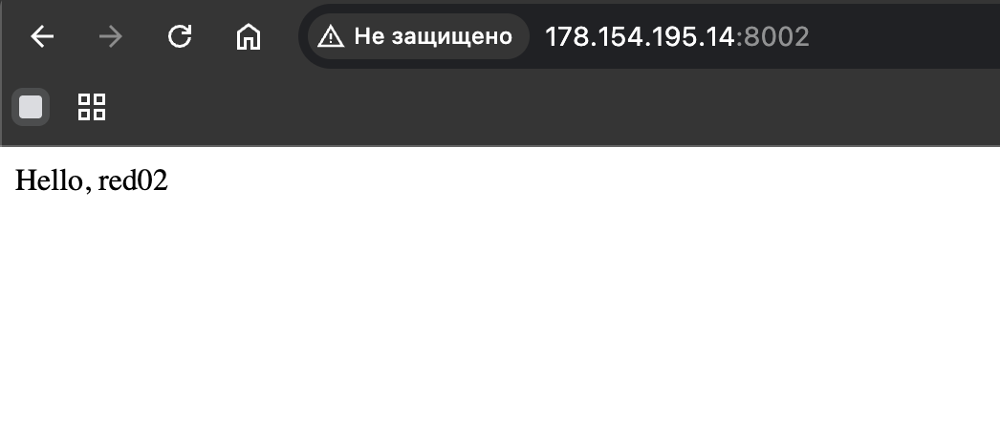
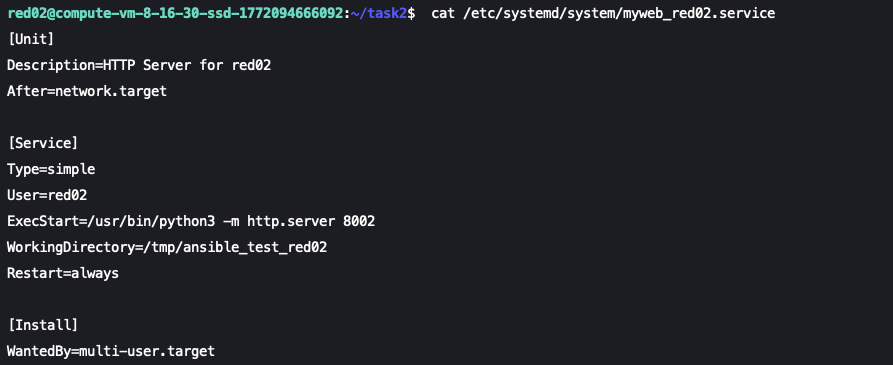

# Практика. Ansible

**Студент:** Лакс Архип Артёмович
**Группа:** 242
**Пользователь:** red02

---

## Задание 1. «Мой первый плейбук»

### Результат выполнения плейбука

### Содержимое созданной директории

### Содержимое файла info.txt

---

## Задание 2. «Сервис на уникальном порту»

### 1. Описание задач (tasks) плейбука — для чего каждое действие

| Task | Модуль | Для чего |
|------|--------|----------|
| Создать рабочую директорию | `file` | Подготовить изолированное пространство `/tmp/ansible_test_red02/` для файлов веб-сервера, исключая конфликты между студентами |
| Создать index.html | `copy` | Обеспечить веб-сервер контентом — персональное приветствие подтверждает, чей сервер отвечает на запросы |
| Создать файл сервиса | `template` | Сгенерировать из Jinja2-шаблона готовый systemd unit-файл с подставленными значениями (`red02`, порт `8002`) |
| Скопировать сервис в systemd | `command` | Поместить unit-файл в `/etc/systemd/system/`, чтобы systemd мог обнаружить и управлять сервисом |
| Перезагрузить systemd | `command` | Заставить systemd перечитать конфигурацию (`daemon-reload`), иначе новый unit-файл не будет виден |
| Запустить сервис | `command` | Запустить Python HTTP-сервер для приёма запросов на порту 8002 |
| Добавить в автозагрузку | `command` | Обеспечить автоматический запуск сервиса при перезагрузке сервера без ручного вмешательства |

### 2. Результат выполнения плейбука

### 3. Результаты проверки

#### a) curl http://localhost:8002

#### b) sudo /usr/local/bin/manage_red02_service.sh status

#### c) Веб-браузер http://178.154.195.14:8002/

### 4. Что такое Jinja2-шаблоны и зачем они нужны в Ansible

**Jinja2** — язык шаблонов для Python, используемый Ansible для динамической генерации конфигурационных файлов.

**Синтаксис:**
- `{{ переменная }}` — подстановка значения переменной
- `` — условные конструкции
- `` — циклы

**Зачем нужны в Ansible:**

1. **Универсальность.** Один шаблон `myweb.service.j2` генерирует уникальные сервисные файлы для каждого студента. Вместо десятков статичных файлов — один шаблон с переменными.

2. **Автоматическая подстановка.** Ansible подставляет значения из блока `vars` (`username: "red02"`, `http_port: 8002`) в шаблон, формируя готовый файл.

3. **Масштабируемость.** Для нового пользователя достаточно изменить переменные, а не создавать конфигурацию вручную.

4. **Модуль `template` vs `copy`.** `template` пропускает файл через Jinja2 перед копированием, заменяя переменные на значения. `copy` копирует файл как есть. Поэтому для генерации сервисного файла используется именно `template`.

**Пример:** в шаблоне `{{ http_port }}` → в итоговом файле `8002`.

### 5. Содержимое сервисного файла

### 6. Описание структуры сервисного файла /etc/systemd/system/myweb_red02.service

Файл описывает системный сервис для systemd. Состоит из трёх секций:

**[Unit]** — метаданные сервиса:

| Строка | Назначение |
|--------|------------|
| `Description=HTTP Server for red02` | Описание сервиса, отображается в `systemctl status` |
| `After=network.target` | Запускать сервис только после инициализации сети, чтобы можно было слушать TCP-порт |

**[Service]** — параметры запуска:

| Строка | Назначение |
|--------|------------|
| `Type=simple` | Systemd считает сервис запущенным сразу после старта процесса (без форка) |
| `User=red02` | Процесс работает от имени red02, а не root (принцип наименьших привилегий) |
| `ExecStart=/usr/bin/python3 -m http.server 8002` | Команда запуска — встроенный Python HTTP-сервер на порту 8002 |
| `WorkingDirectory=/tmp/ansible_test_red02` | Рабочая директория, из которой сервер отдаёт файлы (`index.html`) |
| `Restart=always` | При аварийном завершении процесса systemd автоматически перезапустит его |

**[Install]** — правила автозагрузки:

| Строка | Назначение |
|--------|------------|
| `WantedBy=multi-user.target` | Сервис включается в автозагрузку при многопользовательском режиме (стандартный runlevel Linux-серверов) |
