# Практика. GitLab CI/CD — отчёт

**Логин (gitlab.com):** `artisan.snake0r`
**Логин (gl-hse.gitlab.yandexcloud.net):** `red02`
**STUDENT_NUM:** `02`

Репозитории:
- Задания 1–2: <https://gitlab.com/artisan.snake0r/cis>
- Задание 3: <https://gl-hse.gitlab.yandexcloud.net/red02/red02-app>

---

## Задание 1. Hello CI + базовый pipeline

Цель — понять структуру CI/CD и работу runner.

### 1.1 Базовый pipeline (`hello-job`)

`.gitlab-ci.yml`:

```yaml
stages:
  - build

hello-job:
  stage: build
  script:
    - echo "Hello from $GITLAB_USER_LOGIN"
```

Pipeline [#2477400488](https://gitlab.com/artisan.snake0r/cis/-/pipelines/2477400488) — **SUCCESS**.

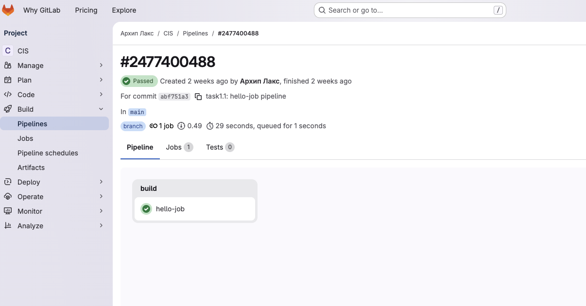

В логе видно подставленное имя пользователя:

```
$ echo "Hello from $GITLAB_USER_LOGIN"
Hello from artisan.snake0r
Job succeeded
```

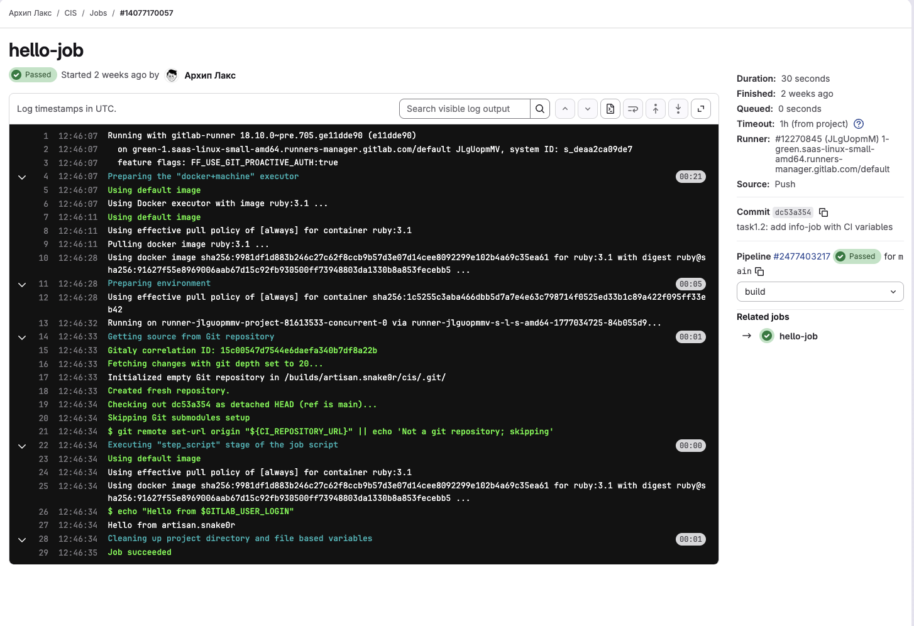

### 1.2 Усложнение — добавлен второй job с CI-переменными

`.gitlab-ci.yml`:

```yaml
stages:
  - build
  - info

hello-job:
  stage: build
  script:
    - echo "Hello from $GITLAB_USER_LOGIN"

info-job:
  stage: info
  script:
    - echo "User $GITLAB_USER_LOGIN"
    - echo "Branch $CI_COMMIT_BRANCH"
    - echo "Pipeline ID $CI_PIPELINE_ID"
```

Pipeline [#2477403217](https://gitlab.com/artisan.snake0r/cis/-/pipelines/2477403217) — **SUCCESS**, обе джобы выполнены последовательно (`build` → `info`).

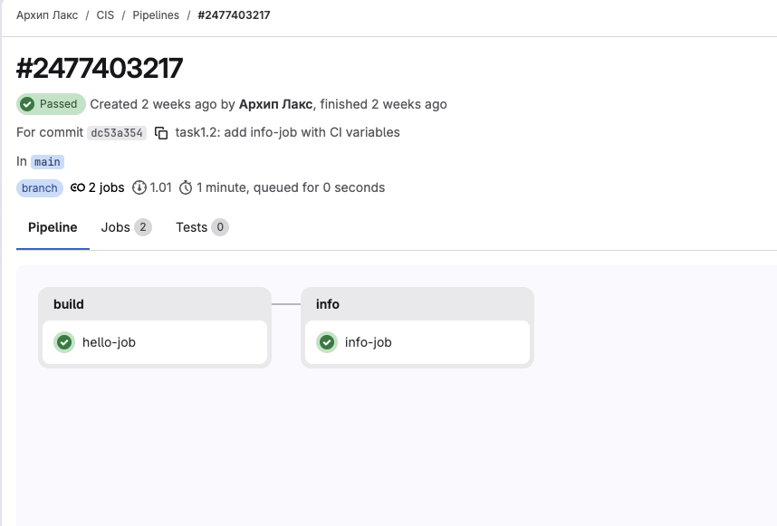

Лог `info-job` (видны предопределённые переменные CI):

```
$ echo "User $GITLAB_USER_LOGIN"
User artisan.snake0r
$ echo "Branch $CI_COMMIT_BRANCH"
Branch main
$ echo "Pipeline ID $CI_PIPELINE_ID"
Pipeline ID 2477403217
Job succeeded
```

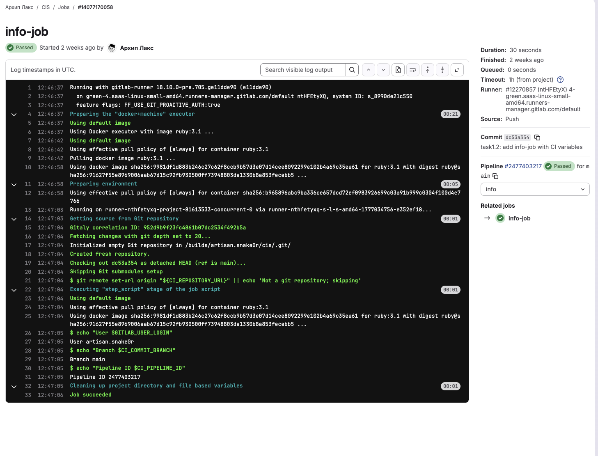

> **Комментарий.** Переменные `$GITLAB_USER_LOGIN`, `$CI_COMMIT_BRANCH`, `$CI_PIPELINE_ID` — это [предопределённые переменные](https://docs.gitlab.com/ee/ci/variables/predefined_variables.html), которые GitLab CI автоматически прокидывает в окружение каждой джобы. Никакого ручного описания в `variables:` не требуется.

---

## Задание 2. Сборка и тестирование Python-приложения

Цель — построить multi-stage pipeline с передачей артефактов между джобами и условным запуском.

### 2.1 Шаг 2 — `install` + `test`

Структура проекта:

```
.
├── app.py
├── test_app.py
├── requirements.txt
└── .gitlab-ci.yml
```

`app.py`:

```python
def add(a, b):
    return a + b
```

`test_app.py`:

```python
from app import add


def test_add():
    assert add(2, 3) == 5
```

`requirements.txt`:

```
pytest==7.4.0
```

`.gitlab-ci.yml` (финальный, с правкой образа — см. ниже):

```yaml
stages:
  - install
  - test

default:
  image: python:3.11

install:
  stage: install
  script:
    - python3 -m venv venv
    - venv/bin/python -m pip install -r requirements.txt
  artifacts:
    paths:
      - venv/

test:
  stage: test
  script:
    - venv/bin/python -m pytest
```

Pipeline [#2477414149](https://gitlab.com/artisan.snake0r/cis/-/pipelines/2477414149) — **SUCCESS**.

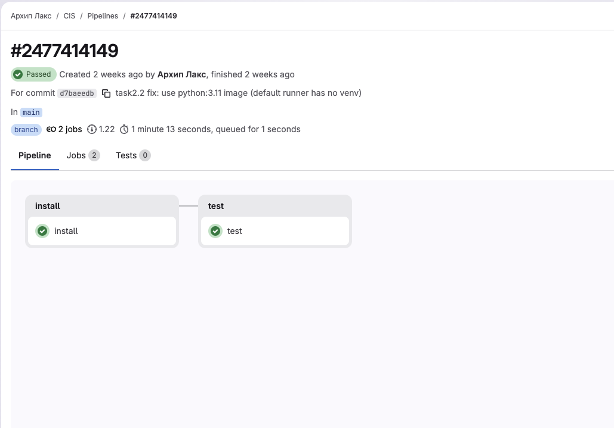

Лог `test`:

```
============================== 1 passed in 0.01s ===============================
Job succeeded
```

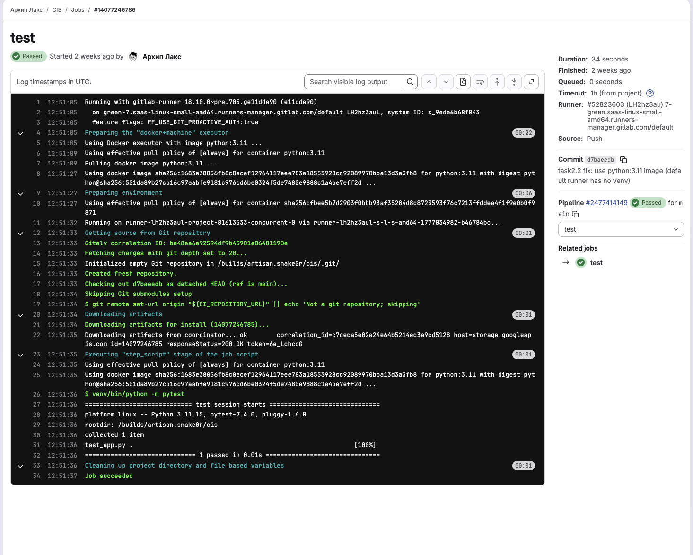

> **Комментарий 1 (важно).** При первой попытке pipeline упал на стадии `install` с ошибкой:
> ```
> The virtual environment was not created successfully because ensurepip is not available.
> ```
> Причина — на shared-runner'е GitLab.com дефолтный image для джоб без явного `image:` — `ruby:3.1`, в нём нет пакета `python3-venv`. Решение: добавить блок
> ```yaml
> default:
>   image: python:3.11
> ```
> После этого `python3 -m venv venv` и `pip install` отрабатывают корректно.
>
> **Комментарий 2.** Каталог `venv/` объявлен как `artifacts` в джобе `install` и автоматически передаётся в следующую джобу `test` — поэтому в `test` доступен `venv/bin/python -m pytest` без повторной установки.

### 2.2 Шаг 3 — ветка `test`, `only: main` для deploy

Создал ветку `test`, в ней заменил `.gitlab-ci.yml`:

```yaml
stages:
  - build
  - deploy

build:
  stage: build
  script:
    - echo "Building..."

deploy:
  stage: deploy
  script:
    - echo "Deploying project for $GITLAB_USER_LOGIN"
  only:
    - main
```

На ветке `test` выполняется **только** `build` — `deploy` пропускается из-за правила `only: main`.

Pipeline на ветке `test` [#2477418113](https://gitlab.com/artisan.snake0r/cis/-/pipelines/2477418113) — **SUCCESS** (1 job).


### 2.3 Merge Request → main

Создан MR [`!1`](https://gitlab.com/artisan.snake0r/cis/-/merge_requests/1) `test → main`, замёрджен через `glab mr merge 1`.

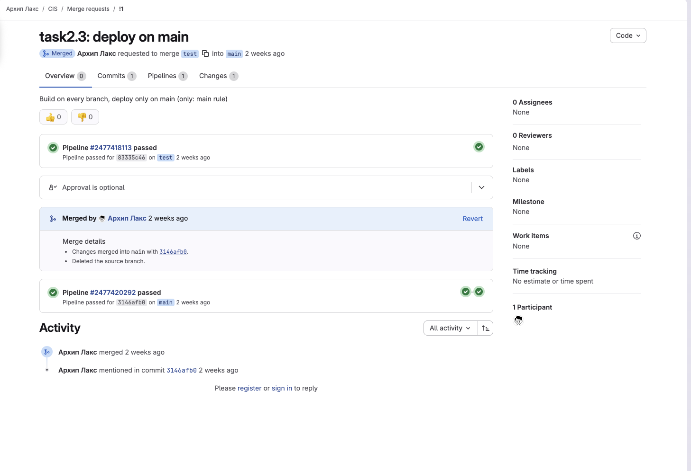

После мерджа в `main` запустился pipeline [#2477420292](https://gitlab.com/artisan.snake0r/cis/-/pipelines/2477420292) — теперь выполнились **обе** джобы `build` и `deploy`:

```
$ echo "Deploying project for $GITLAB_USER_LOGIN"
Deploying project for artisan.snake0r
Job succeeded
```

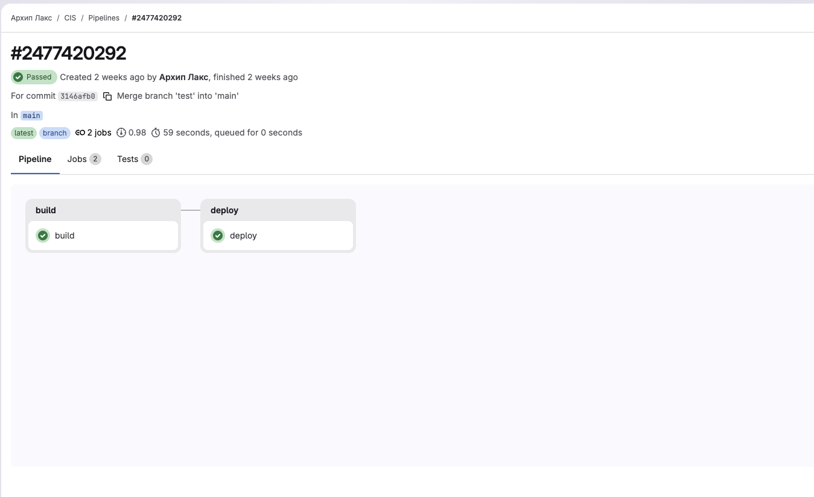

> **Комментарий.** Правило `only: main` — упрощённый синтаксис. В современном GitLab CI рекомендуется использовать более гибкий `rules:`:
> ```yaml
> rules:
>   - if: '$CI_COMMIT_BRANCH == "main"'
> ```
> Но для учебной задачи `only:` валиден и понятен.

---

## Задание 3. Flask + Nginx CI/CD (template `redXX-app`)

Цель — собрать и задеплоить реальное приложение в Docker-контейнерах через CI/CD.

Используется template <https://github.com/ChallengeEverything/gitlab_ci>:

```
.
├── .gitlab-ci.yml
├── docker-compose.yml
├── backend/
│   ├── Dockerfile
│   ├── app.py            (Flask: GET /api/health → 200)
│   └── requirements.txt
└── frontend/
    ├── Dockerfile
    ├── index.html
    ├── style.css
    ├── app.js
    └── nginx.conf
```

`.gitlab-ci.yml` — pipeline из 3 стейджей: `build` → `test` → `deploy`. Все джобы используют переменную окружения `STUDENT_NUM` для именования образов, контейнеров и порта (`40${STUDENT_NUM}`).

### Настройка переменной `STUDENT_NUM`

Переменная заведена через `glab`:

```
$ glab variable set STUDENT_NUM 02 --repo red02/red02-app
✓ Created variable STUDENT_NUM for red02/red02-app with scope *.
```

В UI: **Settings → CI/CD → Variables → STUDENT_NUM = 02**.

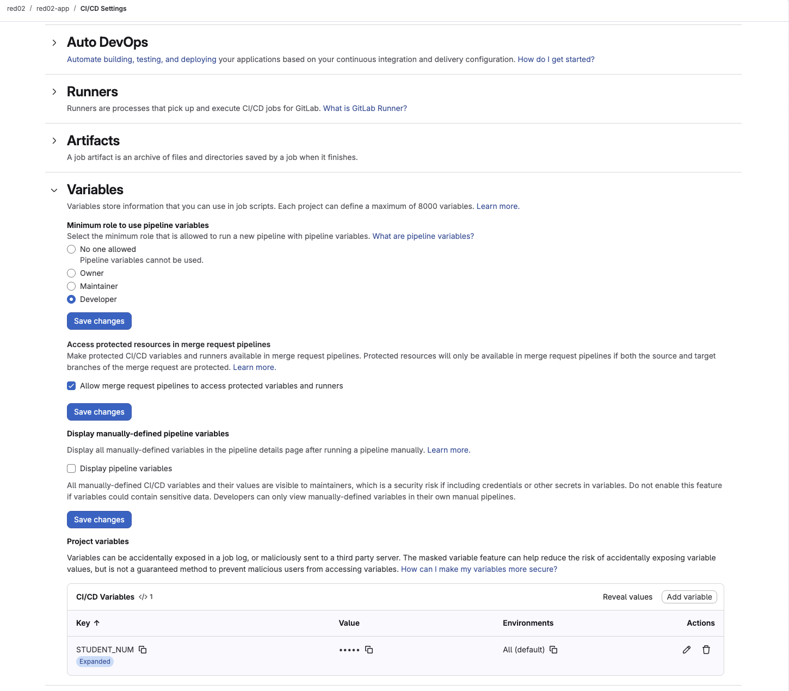

### Pipeline

Pipeline [#328](https://gl-hse.gitlab.yandexcloud.net/red02/red02-app/-/pipelines/328) — **SUCCESS**, 4 джобы:

| Stage  | Job              | Результат |
| ------ | ---------------- | --------- |
| build  | `build-backend`  | SUCCESS   |
| build  | `build-frontend` | SUCCESS   |
| test   | `test-backend`   | SUCCESS (`/api/health` → 200) |
| deploy | `deploy`         | SUCCESS   |

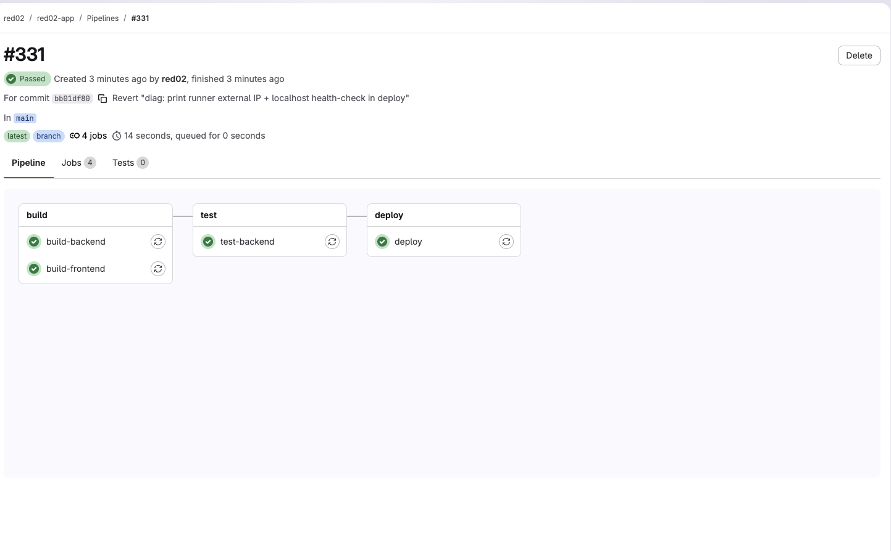

### Deploy

Финальный фрагмент лога `deploy`:

```
Network red02-net Creating ... Created
Container red02-backend  Created ... Started
Container red02-frontend Created ... Started
$ docker ps | grep red02
9a5e873df23c  red02-frontend  ...  0.0.0.0:4002->80/tcp  red02-frontend
72cafa34aebe  red02-backend   ...  5000/tcp              red02-backend
Job succeeded
```

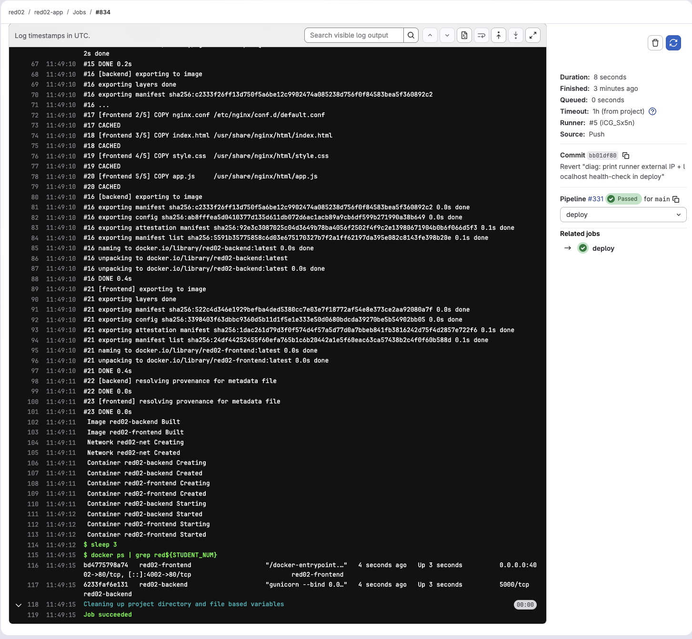

### Проверка работающего приложения

Приложение задеплоено на раннере `it-infr-srv-3` (внешний IP `158.160.1.129`, найден через временный диагностический шаг `curl ifconfig.me` внутри deploy-job).

**URL:** <http://158.160.1.129:4002/>

```
$ curl -sS http://158.160.1.129:4002/
<!DOCTYPE html>
<html lang="ru">
<head>
  <title>red__STUDENT_ID__ App</title>
  ...
</head>
<body>
  <div class="container">
    <h1>GitLab CI/CD Demo</h1>
    <p id="student-label">Student: loading...</p>
    <button id="ping-btn">Ping Backend</button>
    ...
  </div>
</body>
</html>

$ curl -sS http://158.160.1.129:4002/api/health
{"status":"healthy"}
```

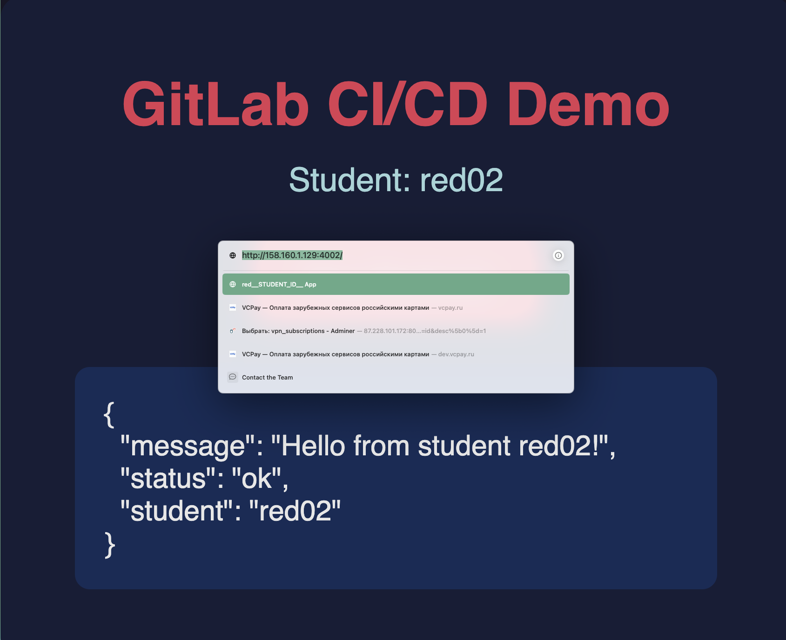

> **Комментарий.**
> - Backend (`red02-backend`) слушает порт `5000` **внутри** Docker-сети `red02-net` — наружу не торчит, по соображениям безопасности.
> - Frontend (`red02-frontend`, nginx) проксирует запросы `/api/*` на backend по DNS-имени `backend` (резолвится Docker'ом внутри bridge-сети) и сам слушает порт `4002` на хосте.
> - Изоляция между студентами обеспечена префиксом `red02-` во всех именах (контейнеры, образы, сеть) и уникальным портом `4002` (формула `40${STUDENT_NUM}`).

---

## Ответы на контрольные вопросы

### 1. С какими трудностями вы столкнулись при анализе Console Output и как логи помогают в поиске ошибок?

Основная сложность — pipeline-логи в GitLab CI длинные и шумные:
- каждая джоба печатает многострочные системные блоки (`Preparing the "docker" executor`, `Getting source from Git repository`, `Pulling docker image …`, `Executing "step_script" stage`);
- shell-команды выполняются под `set -e`, перед каждой выводится строка `$ <команда>` (зелёный курсив);
- timestamps в каждой строке усложняют визуальное чтение.

В Задании 2.1 первый прогон упал — без чтения лога было непонятно, почему. Логи позволили найти конкретную причину:
1. Прокрутка к концу до строки `ERROR: Job failed: exit code 1`.
2. Чуть выше — сообщение `The virtual environment was not created successfully because ensurepip is not available. On Debian/Ubuntu systems, you need to install the python3-venv package`.
3. И самое главное — служебная строка `[0KUsing default image[0;m / Using docker image sha256:... for ruby:3.1`, по которой стало понятно, что джоба запустилась в образе `ruby:3.1`, а не Python.

Логи дают:
- **точную команду**, которая упала, и её stdout/stderr;
- **код завершения** (`exit code 1`, `marked build as failure`);
- **системный контекст** — какой image использовался, какой раннер взял джобу, какие переменные окружения подставлены;
- **сравнимость** между билдами — можно открыть успешный и упавший pipeline рядом и увидеть diff в выводе.

### 2. Какую роль в Задании №3 выполнял Docker, и почему сервер стал доступен по внешнему адресу только после этапа Run Container (`deploy`)?

Docker в Задании 3 выполнял три роли одновременно:

1. **Среда сборки.** На стадии `build` команды `docker build -t red02-backend ./backend` и `docker build -t red02-frontend ./frontend` собрали два независимых образа из соответствующих `Dockerfile`. На стадии `test` команда `docker run --rm red02-backend python -c "from app import app; ..."` запустила backend в одноразовом контейнере и выполнила health-check `GET /api/health` → 200. Это разовый прогон — после `--rm` контейнер удаляется.

2. **Среда исполнения и изоляции.** На стадии `deploy` `docker compose up -d --build` запустил persistent-контейнеры `red02-backend` и `red02-frontend`, связанные сетью `red02-net` (bridge). У каждого студента — собственный namespace ресурсов: префикс `red02-` для контейнеров/образов/сети, уникальный порт `4002`.

3. **Сетевой проброс.** В `docker-compose.yml` секция `ports: - "40${STUDENT_NUM}:80"` пробрасывает порт `80` внутри frontend-контейнера на порт `4002` хоста.

**Почему сервер стал доступен только после `deploy`:**
- стадии `build` собирают образы — это статические артефакты, в них ничего не слушает порты;
- стадия `test` запускает backend в `--rm`-контейнере **без `-p`**: процесс жив, но порт `5000` существует только внутри изолированного network-namespace контейнера;
- только в `deploy` через `docker compose up -d` контейнеры стали постоянно работающими и впервые появилось правило проброса `40${STUDENT_NUM}:80` в iptables хоста. До этой команды любой запрос на `http://<runner-ip>:4002` получал `Connection refused`.

### 3. Зачем мы использовали `STUDENT_NUM` в параметрах сборки? Что произошло бы, если бы все студенты запустили проект без этого параметра?

`STUDENT_NUM` — это «пространство имён» каждого студента в общей multi-tenant инфраструктуре. Из него формируются:

| Ресурс | Шаблон | У red02 |
| ------ | ------ | ------- |
| Имя backend-образа | `red${STUDENT_NUM}-backend` | `red02-backend` |
| Имя frontend-образа | `red${STUDENT_NUM}-frontend` | `red02-frontend` |
| Имя backend-контейнера | `red${STUDENT_NUM}-backend` | `red02-backend` |
| Имя frontend-контейнера | `red${STUDENT_NUM}-frontend` | `red02-frontend` |
| Имя сети | `red${STUDENT_NUM}-net` | `red02-net` |
| Внешний порт | `40${STUDENT_NUM}` | `4002` |
| Compose project | `red${STUDENT_NUM}` | `red02` |

Если бы переменной не было и все использовали одни и те же имена/порт:

1. **Конфликт имён контейнеров.** `docker run --name container` у второго студента упал бы с `Conflict. The container name "/container" is already in use by container "<id>"`. На стадии `deploy` (`docker compose down --remove-orphans || true`) это даже хуже: один студент **сносил бы контейнеры другого** при запуске своего pipeline.
2. **Конфликт портов.** Только один контейнер смог бы занять `40` на хосте (`bind: address already in use`).
3. **Перезапись образов.** `docker build -t backend:latest` у каждого переписывал бы общий тег — другие студенты деплоили бы чужой код.
4. **Race condition в общем compose project.** `docker compose -p <project>` оперирует ресурсами проекта — без префикса все писали бы в один namespace, что превращает работу одного студента в гонку с остальными.
5. **Невозможно различить «свой» сервер.** Все видели бы одинаковую страницу — нельзя проверить, чей именно код выполнился.

`STUDENT_NUM` решает все пять проблем одним параметром, и потому хранится не в коде, а в **CI/CD Variables** репозитория (Settings → CI/CD → Variables) — это позволяет одному и тому же `.gitlab-ci.yml` работать без изменений у каждого студента.

---

## Итоги

| # | Задание | Pipeline / MR | Результат |
| - | ------- | ------------- | --------- |
| 1.1 | hello-job (Hello CI) | [pipelines/2477400488](https://gitlab.com/artisan.snake0r/cis/-/pipelines/2477400488) | SUCCESS |
| 1.2 | + info-job (CI-переменные) | [pipelines/2477403217](https://gitlab.com/artisan.snake0r/cis/-/pipelines/2477403217) | SUCCESS |
| 2.1 | install + test (multi-stage) | [pipelines/2477414149](https://gitlab.com/artisan.snake0r/cis/-/pipelines/2477414149) | SUCCESS, 1 passed |
| 2.2 | branch `test` (only main) | [pipelines/2477418113](https://gitlab.com/artisan.snake0r/cis/-/pipelines/2477418113) | SUCCESS (только build) |
| 2.3 | MR → main + deploy | [!1](https://gitlab.com/artisan.snake0r/cis/-/merge_requests/1), [pipelines/2477420292](https://gitlab.com/artisan.snake0r/cis/-/pipelines/2477420292) | SUCCESS (build + deploy) |
| 3 | Flask + Nginx CI/CD | [red02-app/pipelines/328](https://gl-hse.gitlab.yandexcloud.net/red02/red02-app/-/pipelines/328) | SUCCESS (build × 2 + test + deploy), порт 4002 |
