# Практика. Jenkins — отчёт

**Логин:** `red02`
**Jenkins:** http://89.169.185.172:8080/
**XX (ваш номер):** `02`

---

## Задание 1. Создание первого Job (`myJenkinsJob_02`)

- Тип: Freestyle project
- Description: `My first Jenkins Job`
- Build Step: Execute shell → `echo "Hello World!"`
- Результат: **SUCCESS**, билд `#1`

### Страница Job

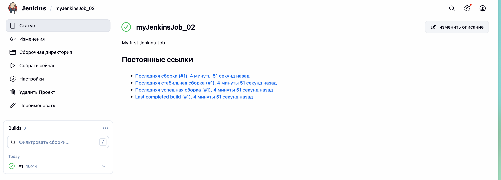

### Console Output

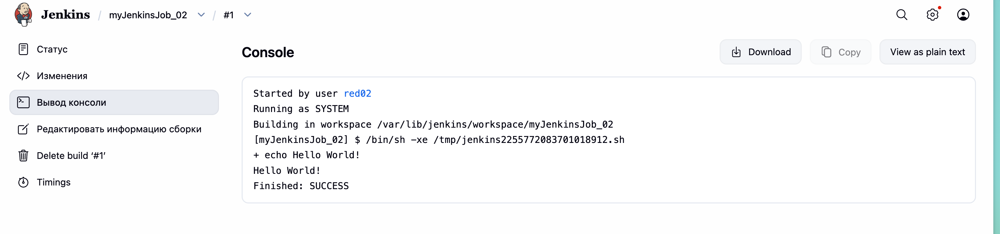


---

## Задание 2. Создание веб-страницы (`WebPage_02`)

- Тип: Freestyle project
- Ротация логов: **5 дней** (Discard old builds → Log Rotation → Days to keep builds = 5)
- Два Execute Shell шага: генерация `index.html` + тест через `grep "My first Test" | grep "Arial" | wc -l`

### Страница Job (видны оба билда: #1 SUCCESS, #2 FAILURE)

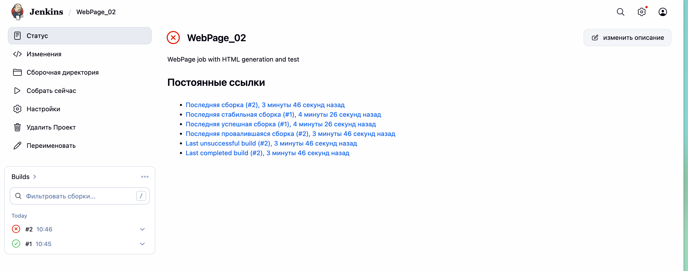

### Настройка ротации логов (5 дней)

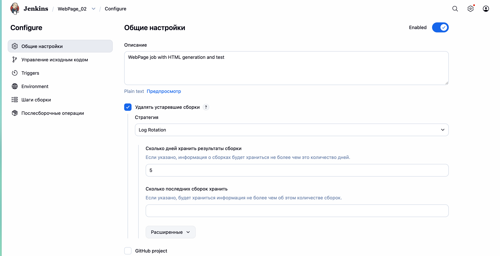

### Билд `#1` — SUCCESS (Arial в обеих строках)

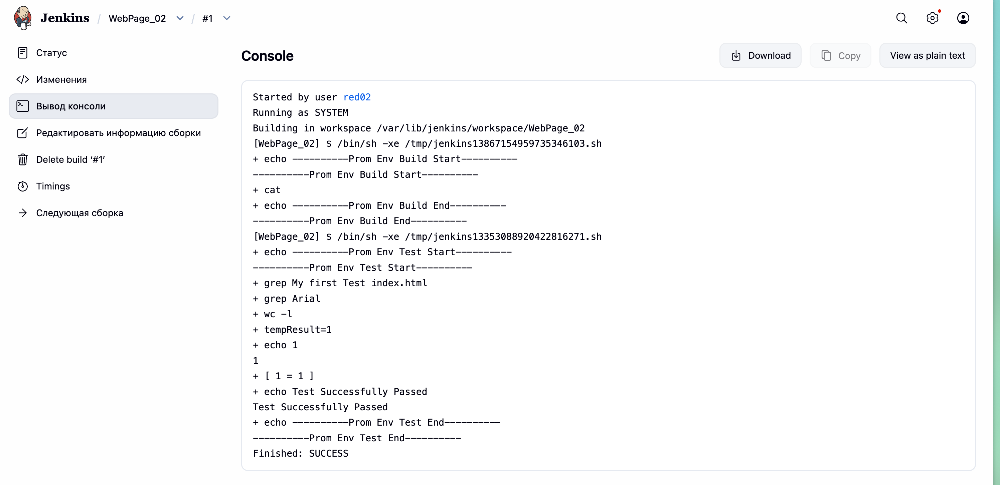

### Билд `#2` — FAILURE (в строке `My first Test Env Build` шрифт заменён на `face="Test"`)

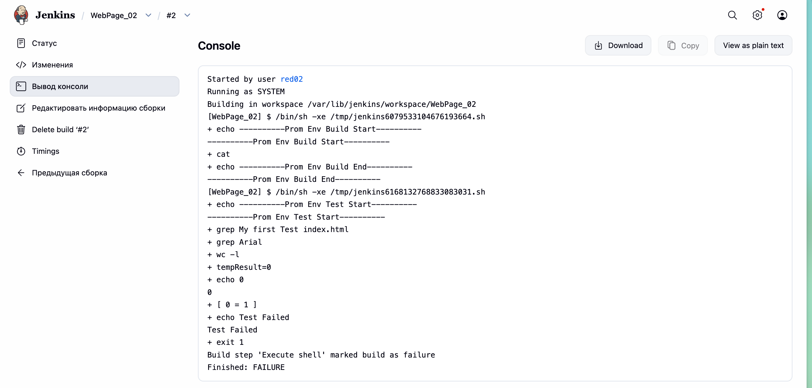

```
+ grep My first Test index.html
+ grep Arial
+ wc -l
+ tempResult=0
+ echo 0
0
+ [ 0 = 1 ]
+ echo Test Failed
Test Failed
+ exit 1
Build step 'Execute shell' marked build as failure
Finished: FAILURE
```

После правки `face="Arial"` → `face="Test"` второе условие `grep Arial` возвращает 0 строк, проверка `[ "$tempResult" = "1" ]` падает → `exit 1` → билд FAILURE.

---

## Задание 3. Развёртывание Python-сервера (`web-server-job_02`)

- Тип: Pipeline
- Параметр: `STUDENT_ID = 02`
- Pipeline создаёт `app.py` и `Dockerfile`, удаляет старый контейнер, собирает образ `img_user02`, запускает `container_user02` на порту `7002`
- Результат: **SUCCESS**

### Stage View пайплайна

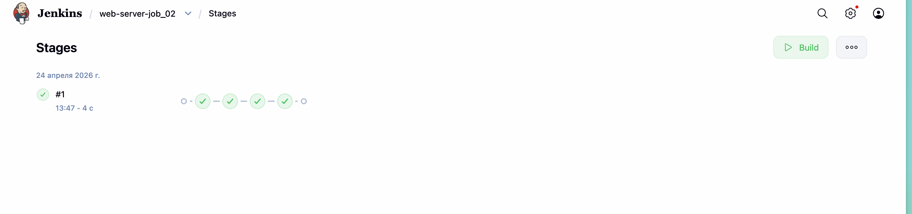

### Console Output (начало: Create Files + Cleanup)

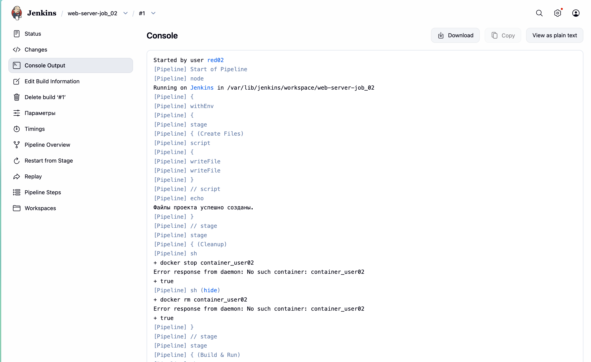

### Console Output (середина: docker build образа `img_user02`)

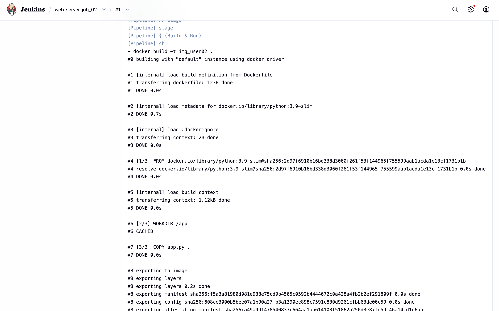

### Console Output (конец: docker run + SUCCESS)

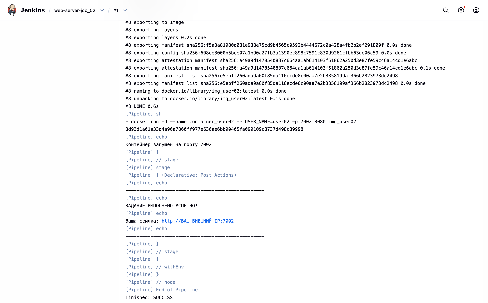

### Проверка сервера в браузере

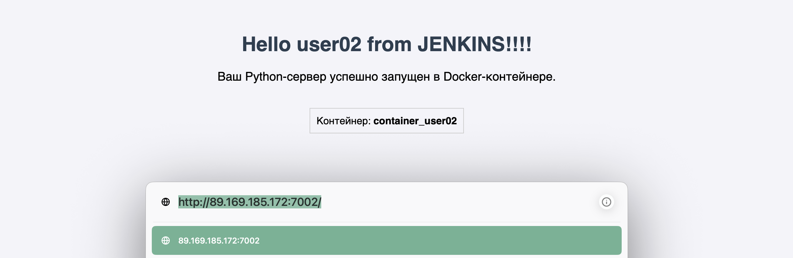

```
$ curl http://89.169.185.172:7002/
HTTP 200

<html>
<body>
  <h1>Hello user02 from JENKINS!!!!</h1>
  <p>Ваш Python-сервер успешно запущен в Docker-контейнере.</p>
  <div>Контейнер: <b>container_user02</b></div>
</body>
</html>
```

Ссылка: **http://89.169.185.172:7002/**

---

## Ответы на контрольные вопросы

### 1. С какими трудностями вы столкнулись при анализе Console Output и как логи помогают в поиске ошибок?

Основная трудность — отличить реальную ошибку от обычного вывода команды: при `set -xe` shell печатает каждую команду перед выполнением (строки с `+`), поэтому лог выглядит «шумным». Вторая сложность — у pipeline-билдов лог длинный (каждый `stage`/`step` добавляет свои служебные блоки `[Pipeline]`), и ключевую строку вроде `Finished: FAILURE` нужно искать в самом конце.

Логи помогают так:
- показывают **точную команду**, которая упала, и её stdout/stderr;
- фиксируют **код завершения** (`marked build as failure`, `exit 1`);
- содержат вывод `echo`-маркеров (`Prom Env Build Start/End`), по которым видно, на каком этапе сломалось;
- сохраняют историю предыдущих билдов — можно сравнить успешный и упавший прогон и увидеть разницу (например, `tempResult=1` vs `tempResult=0` в задании 2).

### 2. Какую роль в Задании №3 выполнял Docker, и почему сервер стал доступен по внешнему адресу только после этапа Run Container?

Docker в Задании 3 выполнял роль **среды исполнения и изоляции**:
- в образе собрана фиксированная версия Python (`python:3.9-slim`) и скопирован `app.py` — получилась воспроизводимая сборка, не зависящая от того, что установлено на Jenkins-агенте;
- каждый студент получил **изолированный контейнер** с уникальным именем (`container_user02`) и образом (`img_user02`), поэтому параллельные запуски не конфликтуют;
- переменная окружения `USER_NAME=user02` пробрасывается через `-e`, разделяя состояние между контейнерами.

До этапа **Run Container** никакой Python-процесс не был запущен: этап *Build* только собирает образ (это статический артефакт, в нём ничего не слушает порты), этап *Cleanup* останавливает старую версию. Сервер начинает принимать запросы только после `docker run -d --name ... -p 7002:8080 ...` — именно `-p 7002:8080` **пробрасывает** порт 8080 внутри контейнера на внешний порт 7002 хоста. Без этого флага порт контейнера остался бы замкнут внутри сетевого пространства Docker, и обращение по внешнему IP вернуло бы `Connection refused`.

### 3. Зачем мы использовали STUDENT_ID в параметрах сборки? Что произошло бы, если бы все студенты запустили проект без этого параметра?

`STUDENT_ID` нужен для **изоляции ресурсов** в общей многопользовательской среде. Из него формируются:

- внешний порт `70${STUDENT_ID}` (у меня `7002`);
- имя контейнера `container_user${STUDENT_ID}`;
- имя Docker-образа `img_user${STUDENT_ID}`;
- приветствие `Hello user${STUDENT_ID}` в HTML.

Если бы параметра не было и все использовали одни и те же имена/порт, произошло бы следующее:

1. **Конфликт имён контейнеров** — `docker run --name container_user` у второго студента упал бы с ошибкой `Conflict. The container name is already in use`. Stage *Cleanup* чужой контейнер останавливать не должен, но на практике пайплайн как раз его бы и убил — один студент ронял бы сервер другого.
2. **Конфликт портов** — только один контейнер смог бы занять порт на хосте, остальные получили бы `bind: address already in use`.
3. **Перезапись образа** — `docker build -t img_user` у каждого переписывал бы общий тег, и другие студенты получили бы чужой код.
4. **Неверный контент страницы** — все видели бы одно и то же приветствие, нельзя было бы отличить свой сервер от чужого.

Параметр `STUDENT_ID` — это, по сути, «пространство имён» для студента, реализующее принцип изоляции в shared-инфраструктуре.

---

## Итоги

| Job                  | Тип           | Последний билд | Результат |
| -------------------- | ------------- | -------------- | --------- |
| `myJenkinsJob_02`    | Freestyle     | #1             | SUCCESS   |
| `WebPage_02`         | Freestyle     | #1             | SUCCESS   |
| `WebPage_02`         | Freestyle     | #2             | FAILURE (запланированно, демонстрация падения теста) |
| `web-server-job_02`  | Pipeline      | #1             | SUCCESS   |

Сервер развёрнут и доступен: http://89.169.185.172:7002/
