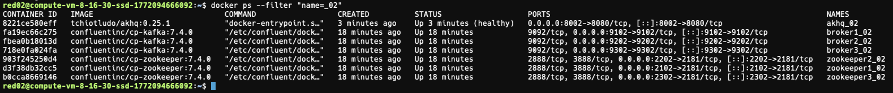
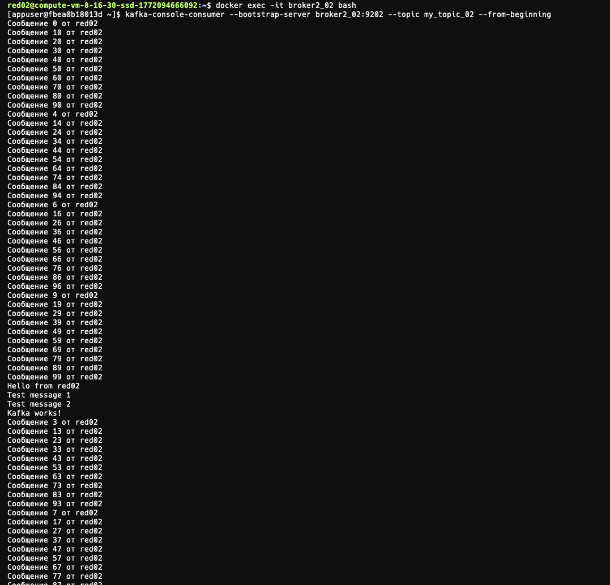
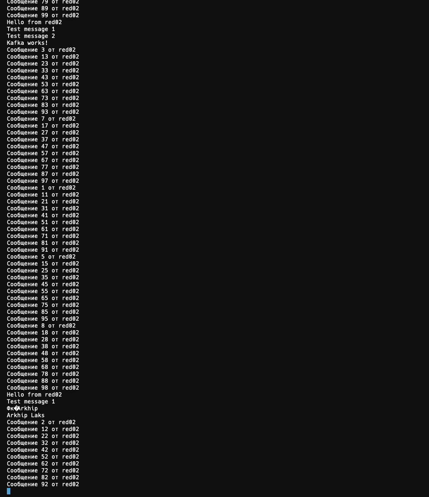
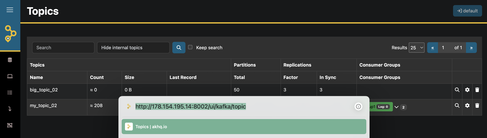
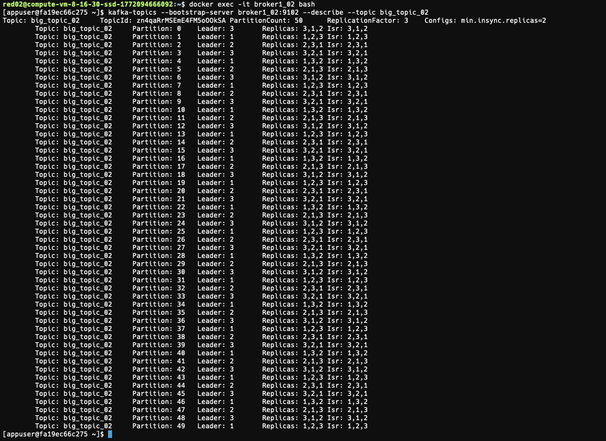
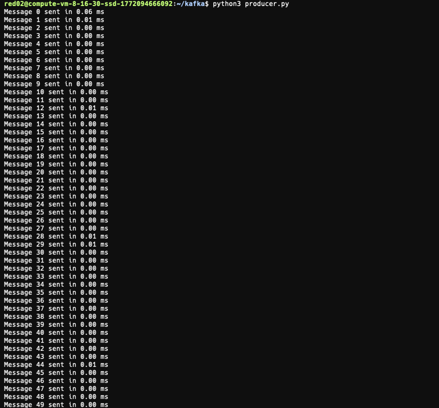
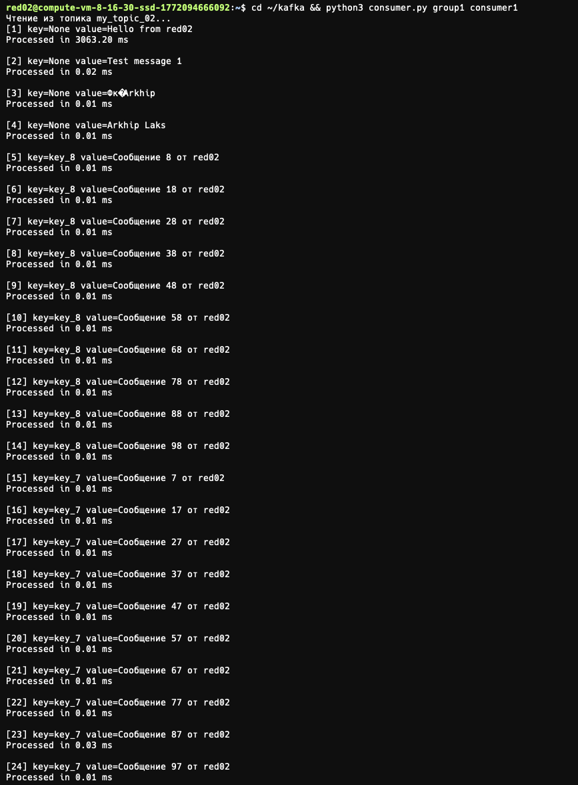
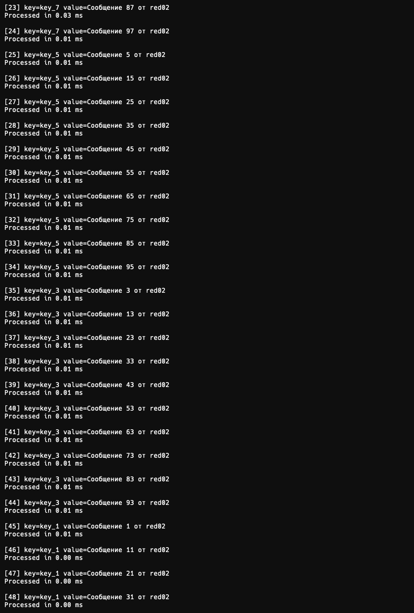

# Практика. Kafka

**Студент:** Лакс Архип Артёмович
**Группа:** 242
**Пользователь:** red02

---

## Задание 1. Kafka Producer & Consumer

### Цель

Научиться работать с Kafka изнутри контейнеров: создавать топики, отправлять сообщения (producer) и получать сообщения (consumer), проверить взаимодействие брокеров в кластере.

### 1. Развёртывание кластера

#### Создание файла .env

На сервере в директории `~/kafka` создан скрипт `env_settings.sh`, который автоматически генерирует файл `.env` с уникальными портами для пользователя red02:

```bash
./env_settings.sh
```

Содержимое сгенерированного `.env`:

```
USER_ID=02
HOST_IP=10.129.0.39

ZK1_PORT=2102
ZK2_PORT=2202
ZK3_PORT=2302

B1_PORT=9102
B2_PORT=9202
B3_PORT=9302

AKHQ_PORT=8002
```

Порты формируются по шаблону `<базовый_порт><USER_ID>`, что исключает конфликты между студентами на одном сервере.

#### Запуск docker compose

```bash
docker compose --env-file .env -p kafka_02 up -d
```

- `--env-file .env` — подстановка переменных окружения из файла
- `-p kafka_02` — уникальное имя проекта для изоляции Docker-сети от других студентов
- `-d` — запуск в фоновом режиме

#### Проверка запущенных контейнеров

```bash
docker ps --filter "name=_02"
```



Все 7 контейнеров работают:
- 3 Zookeeper (zookeeper1_02, zookeeper2_02, zookeeper3_02) — распределённая координация кластера
- 3 Kafka Broker (broker1_02, broker2_02, broker3_02) — обработка сообщений
- 1 AKHQ (akhq_02) — веб-интерфейс для администрирования кластера

### 2. Создание топика

Подключение к контейнеру broker1:

```bash
docker exec -it broker1_02 bash
```

Создание топика `my_topic_02`:

```bash
kafka-topics \
  --bootstrap-server broker1_02:9102 \
  --create \
  --topic my_topic_02 \
  --replication-factor 3 \
  --partitions 50
```

- `--bootstrap-server broker1_02:9102` — адрес брокера для подключения (используется имя контейнера, т.к. команда выполняется внутри Docker-сети)
- `--replication-factor 3` — каждая партиция реплицируется на все 3 брокера
- `--partitions 50` — топик разбит на 50 партиций для параллельной обработки

### 3. Отправка сообщений (Producer на broker1)

```bash
kafka-console-producer \
  --broker-list broker1_02:9102 \
  --topic my_topic_02
```

В интерактивном режиме введены сообщения: `Hello from red02`, `Test message 1`, `Test message 2`, `Kafka works`.

### 4. Получение сообщений (Consumer на broker2)

В отдельной сессии — подключение к broker2 и запуск consumer:

```bash
docker exec -it broker2_02 bash
kafka-console-consumer \
  --bootstrap-server broker2_02:9202 \
  --topic my_topic_02 \
  --from-beginning
```

- `--from-beginning` — читать все сообщения с начала топика
- Consumer запущен на **другом** брокере (broker2), что подтверждает репликацию данных между брокерами





Все сообщения, отправленные через producer на broker1, успешно прочитаны consumer-ом на broker2.

### 5. Проверка в AKHQ

Веб-интерфейс AKHQ доступен по адресу `http://178.154.195.14:8002/`:



В интерфейсе отображаются созданные топики с информацией о количестве сообщений, партициях, репликации и consumer groups.

---

## Задание 2. Настройка отказоустойчивости Kafka

### Переконфигурация кластера

В `docker-compose.yaml` для каждого брокера добавлены параметры отказоустойчивости:

```yaml
KAFKA_OFFSETS_TOPIC_REPLICATION_FACTOR: 3
KAFKA_TRANSACTION_STATE_LOG_REPLICATION_FACTOR: 3
KAFKA_TRANSACTION_STATE_LOG_MIN_ISR: 2
KAFKA_MIN_INSYNC_REPLICAS: 2
KAFKA_AUTO_CREATE_TOPICS_ENABLE: "true"
```

| Параметр | Значение | Назначение |
|----------|----------|------------|
| `KAFKA_OFFSETS_TOPIC_REPLICATION_FACTOR` | 3 | Системный топик `__consumer_offsets` реплицируется на все 3 брокера — при падении одного брокера информация о смещениях consumer-ов не теряется |
| `KAFKA_TRANSACTION_STATE_LOG_REPLICATION_FACTOR` | 3 | Лог транзакций реплицируется на все 3 брокера для обеспечения exactly-once семантики |
| `KAFKA_TRANSACTION_STATE_LOG_MIN_ISR` | 2 | Минимум 2 синхронные реплики для лога транзакций — запись подтверждается только при записи на 2+ брокера |
| `KAFKA_MIN_INSYNC_REPLICAS` | 2 | Минимум 2 синхронные реплики для пользовательских топиков — гарантия, что данные сохранены минимум на 2 брокерах |
| `KAFKA_AUTO_CREATE_TOPICS_ENABLE` | true | Автоматическое создание топиков при первом обращении |

### Создание и проверка топика

```bash
docker exec -it broker1_02 bash

kafka-topics \
  --bootstrap-server broker1_02:9102 \
  --create \
  --topic big_topic_02 \
  --partitions 50 \
  --replication-factor 3
```

Проверка конфигурации:

```bash
kafka-topics \
  --bootstrap-server broker1_02:9102 \
  --describe \
  --topic big_topic_02
```



### Ожидаемый результат — подтверждён

1. **Репликация:** `ReplicationFactor: 3` — каждая партиция хранится на всех 3 брокерах
2. **ISR (In-Sync Replicas):** все партиции имеют ISR из 3 брокеров (1,2,3) — все реплики синхронизированы
3. **Конфигурация:** `min.insync.replicas=2` — применена к топику
4. **Распределение партиций:** лидеры равномерно распределены по брокерам:
   - Partition: 0 → Leader: 3, Replicas: 3,1,2
   - Partition: 1 → Leader: 1, Replicas: 1,2,3
   - Partition: 2 → Leader: 2, Replicas: 2,3,1

---

## Задание 3. Подключение кастомных Producer и Consumer

### Код Producer (producer.py)

```python
import time
from confluent_kafka import Producer
from dotenv import load_dotenv
import os

load_dotenv()

IP_ADDR = os.getenv("HOST_IP")
USER_ID = os.getenv("USER_ID")

topic = f"my_topic_{USER_ID}"

conf = {
    "bootstrap.servers": f"{IP_ADDR}:91{USER_ID},{IP_ADDR}:92{USER_ID},{IP_ADDR}:93{USER_ID}",
    "security.protocol": "PLAINTEXT",
    "client.id": f"producer_red{USER_ID}",
    "acks": "all",
    "linger.ms": 10,
    "max.in.flight.requests.per.connection": 5,
    "enable.idempotence": True,
    "compression.type": "lz4",
    "batch.size": 32 * 1024,
}

producer = Producer(conf)

for i in range(100):
    key = f"key_{i % 10}"
    value = f"Сообщение {i} от red{USER_ID}"
    producer.produce(topic=topic, key=key.encode(), value=value.encode())

producer.flush()
```

| Параметр конфигурации | Значение | Назначение |
|-----------------------|----------|------------|
| `bootstrap.servers` | 3 брокера | Подключение ко всем брокерам для отказоустойчивости |
| `acks` | `all` | Сообщение считается доставленным, когда **все** ISR-реплики подтвердили запись. В связке с `min.insync.replicas=2` гарантирует, что данные записаны минимум на 2 брокера |
| `enable.idempotence` | `True` | Защита от дублирования сообщений при сетевых ретраях — каждое сообщение получает уникальный sequence number |
| `compression.type` | `lz4` | Сжатие батчей для снижения нагрузки на сеть |
| `linger.ms` | 10 | Задержка перед отправкой для формирования батча — повышает пропускную способность |
| `batch.size` | 32768 | Максимальный размер батча (32 КБ) |

### Запуск Producer

```bash
cd ~/kafka
python3 producer.py
```



100 сообщений отправлены с ключами `key_0`..`key_9`. Ключи обеспечивают распределение по партициям: сообщения с одинаковым ключом попадают в одну и ту же партицию.

### Код Consumer (consumer.py)

```python
from confluent_kafka import Consumer, KafkaException
from dotenv import load_dotenv
import os, sys, time

load_dotenv()

IP_ADDR = os.getenv("HOST_IP")
USER_ID = os.getenv("USER_ID")
topic = f"my_topic_{USER_ID}"

def create_consumer(group_id, client_id):
    conf = {
        "bootstrap.servers": f"{IP_ADDR}:91{USER_ID},{IP_ADDR}:92{USER_ID},{IP_ADDR}:93{USER_ID}",
        "group.id": group_id,
        "client.id": client_id,
        "auto.offset.reset": "earliest",
        "enable.auto.commit": False,
    }
    consumer = Consumer(conf)
    consumer.subscribe([topic])
    # ... чтение сообщений в цикле ...

if __name__ == "__main__":
    create_consumer(sys.argv[1], sys.argv[2])
```

| Параметр конфигурации | Значение | Назначение |
|-----------------------|----------|------------|
| `group.id` | аргумент | Идентификатор consumer group — Kafka распределяет партиции между consumer-ами одной группы |
| `auto.offset.reset` | `earliest` | При первом подключении группы — читать с начала топика |
| `enable.auto.commit` | `False` | Ручное подтверждение обработки сообщений — гарантия, что смещение сохраняется только после обработки |

### Запуск Consumer

```bash
cd ~/kafka
python3 consumer.py group1 consumer1
```





Consumer успешно прочитал все сообщения с ключами и значениями.

---

## Контрольные вопросы

### 1. Что означает параметр replication.factor в Kafka и зачем он нужен?

**replication.factor** определяет, на скольких брокерах хранится копия каждой партиции топика. При `replication.factor=3` каждая партиция существует в 3 экземплярах на разных брокерах. Это обеспечивает отказоустойчивость: при падении одного или даже двух брокеров данные не теряются, т.к. сохраняется хотя бы одна копия на работающем брокере.

### 2. Какую роль играет параметр min.insync.replicas и как он влияет на надёжность записи?

**min.insync.replicas** задаёт минимальное количество реплик, которые должны подтвердить запись сообщения, прежде чем оно считается успешно записанным (при `acks=all`). При `min.insync.replicas=2` запись подтверждается, только когда данные записаны минимум на 2 брокера. Если синхронных реплик меньше порога — producer получит ошибку `NotEnoughReplicas`, что предотвращает запись данных с риском потери.

### 3. Почему в producer используется настройка acks=all и как она связана с min.insync.replicas?

**acks=all** означает, что producer ожидает подтверждения записи от **всех** реплик, входящих в ISR (In-Sync Replicas). В сочетании с `min.insync.replicas=2` это создаёт гарантию: сообщение считается записанным, только когда минимум 2 брокера подтвердили приём. Без `acks=all` параметр `min.insync.replicas` не имеет эффекта — при `acks=1` достаточно подтверждения только лидера.

### 4. Зачем в Kafka-кластере используется несколько брокеров (broker1, broker2, broker3)?

Несколько брокеров обеспечивают:
- **Отказоустойчивость** — при падении одного брокера остальные продолжают обслуживать запросы, лидерство партиций автоматически переходит к другим брокерам.
- **Горизонтальное масштабирование** — партиции распределяются между брокерами, что позволяет параллельно обрабатывать больше данных.
- **Балансировку нагрузки** — producer и consumer подключаются к разным брокерам, распределяя нагрузку.

### 5. Почему внутри контейнера Kafka нужно подключаться к брокеру по имени broker1:91XX, а не через localhost?

Каждый контейнер Docker — это отдельный сетевой namespace с собственным localhost. Внутри контейнера broker1 `localhost` указывает на сам broker1. Но если нужно обратиться к broker1 из другого контейнера — `localhost` укажет на тот контейнер, из которого идёт обращение. Docker Compose создаёт общую сеть, в которой контейнеры доступны по имени сервиса (`broker1_02`). Использование имени контейнера обеспечивает корректную маршрутизацию.

### 6. Что такое partition в Kafka и зачем топик создавался с 50 партициями?

**Partition** — единица параллелизма в Kafka. Каждый топик делится на партиции, которые распределяются по брокерам. Внутри партиции сообщения строго упорядочены. 50 партиций позволяют:
- Распределить нагрузку записи/чтения между брокерами
- Подключить до 50 consumer-ов в одной группе (каждый читает свою партицию)
- Увеличить общую пропускную способность топика

Чем больше партиций — тем выше параллелизм, но растёт потребление ресурсов (файловые дескрипторы, память).

### 7. Как Kafka распределяет сообщения по партициям и какую роль играет ключ сообщения?

Если **ключ указан** — Kafka вычисляет хеш ключа и направляет сообщение в партицию `hash(key) % num_partitions`. Сообщения с одинаковым ключом всегда попадают в одну партицию, что гарантирует их упорядоченность. Если **ключ не указан** — используется round-robin или sticky partitioning (батч заполняется в одну партицию, потом переключается на следующую).

В producer.py ключи `key_0`..`key_9` обеспечивают распределение 100 сообщений по 10 партициям (по 10 сообщений в каждой).

### 8. Что означает поле ISR (In-Sync Replicas) в выводе kafka-topics --describe?

**ISR** — список реплик, которые полностью синхронизированы с лидером партиции. Реплика попадает в ISR, если она успешно получила все сообщения от лидера с задержкой не более `replica.lag.time.max.ms` (по умолчанию 30 секунд). Если реплика отстаёт — она исключается из ISR. Количество ISR определяет, сколько реплик могут стать лидером при отказе текущего лидера.

### 9. Что произойдёт, если один брокер в кластере остановить при replication.factor=3 и min.insync.replicas=2?

При остановке одного брокера из трёх:

- **Новые сообщения будут приниматься** — останется 2 синхронные реплики (ISR=2), что удовлетворяет `min.insync.replicas=2`. Producer с `acks=all` получит подтверждение от 2 оставшихся реплик.
- **Старые сообщения будут читаться** — данные доступны на оставшихся 2 брокерах. Consumer продолжит работу без перерыва, т.к. Kafka автоматически переключит лидерство партиций на доступные брокеры.

Если бы упали 2 брокера (ISR=1 < min.insync.replicas=2), запись новых сообщений была бы заблокирована, но чтение продолжило бы работать.
